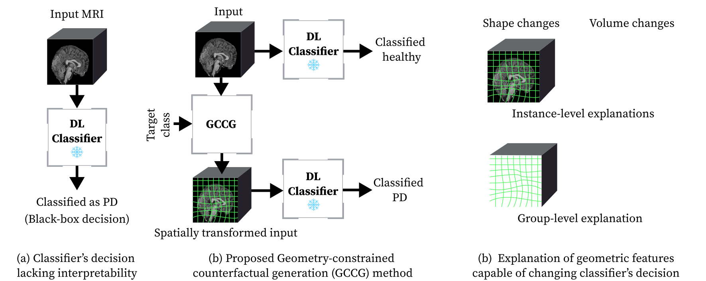

# Morphometric-Explanations
The official code used in article "Morphometric Explanations for Deep Learning Based Neuroimaging Classifiers"



## Citation

If you found this work useful, please cite our [research article](https://doi.org/10.1002/hbm.70633).

```
@article{https://doi.org/10.1002/hbm.70633,
author = {Arudkar, Ankush Gajanan and Evans, Bernard J. E. and Sghirripa, Sabrina and Jenkinson, Mark and for the Alzheimer's Disease Neuroimaging Initiative},
title = {Morphometric Explanations for Deep Learning Based Neuroimaging Classifiers},
journal = {Human Brain Mapping},
volume = {47},
number = {12},
pages = {e70633},
keywords = {counterfactual explanation, explainable artificial intelligence, magnetic resonance imaging},
doi = {https://doi.org/10.1002/hbm.70633},
url = {https://onlinelibrary.wiley.com/doi/abs/10.1002/hbm.70633},
eprint = {https://onlinelibrary.wiley.com/doi/pdf/10.1002/hbm.70633},
note = {e70633 1346461},
year = {2026}
}
```